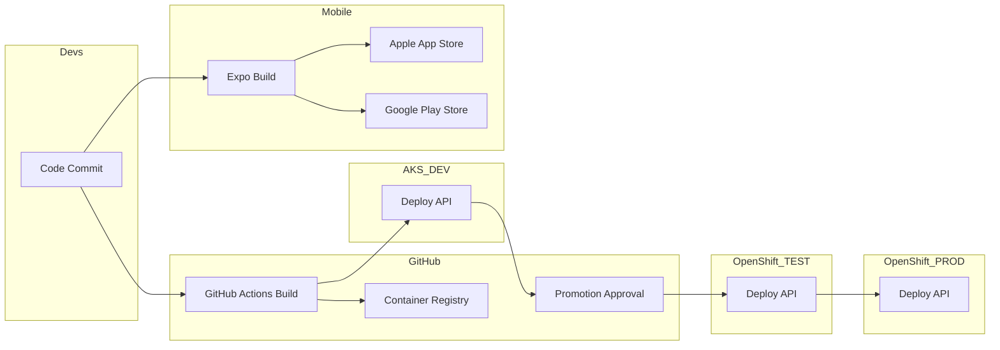

# Mary Guide Platform Architecture

## 1. Introduction

This document describes the target architecture for a mobile-first enterprise platform  for the Mary guide consisting of:

- iOS application
- Android application
- WebUI client (information screens)
- .NET 10 GraphQL API backend
- Umbraco CMS
- Keycloak (federated to Entra ID for staging logins)
- PostgreSQL cluster (operator-managed)

The platform is designed for:

- Kubernetes-native deployment

- Controlled promotion across Dev → Test → Prod

- Enterprise-grade security

- Clear separation of stateless and stateful workloads

- Internet exposure exclusively via F5 (WAF + TLS)

# 2. Technology Choices & Architecture Decisions
## ADR-001: Backend Runtime (.NET 10)

### Decision

- Use .NET 10 (LTS) for backend services.

- Containerized workloads.

- Linux-based container images.

### Rationale

- Long-term support lifecycle.

- Improved performance, memory efficiency and native AOT improvements.

- First-class container support.

- Better async and high-throughput workload optimization.

- Modern minimal hosting model.

### Consequences

- All services must follow container-first patterns.

- No reliance on Windows-only runtime features.

- CI/CD must validate Linux container builds.

## ADR-002: API Architecture

### Decision

- GraphQL API using .NET 10

- Stateless service

- Horizontal Pod Autoscaler enabled

### Rationale

- Efficient client-driven data shaping.

- Reduces over-fetching in mobile apps.

- Better bandwidth utilization.

- Easy horizontal scaling.

### Scaling Model

- Minimum 3 replicas in production.

- HPA based on CPU and/or custom metrics (RPS/latency).

## ADR-003: Kubernetes Platform Strategy

### Decision

- OpenShift (on-prem) for Test and Production.

- AKS for Development.

### Rationale

- Production stability under Operations control.

- Clear governance in OpenShift.

- Faster developer iteration in AKS.

- Environment isolation.

## ADR-004: Edge & Ingress

### Decision

F5 handles:

- TLS termination

- WAF inspection

- Rate limiting

- F5 forwards to OpenShift Router.

- No service mesh initially.

### Rationale

- Enterprise security compliance.

- Centralized certificate lifecycle.

- Reduced operational complexity.

- Future option: introduce Service Mesh (Envoy) if traffic policies or mTLS required.

## ADR-005: Identity Architecture

### Decision

- Keycloak as OIDC provider.

- Federation to Entra ID or Region H Active directory for staging logins.

- Applications authenticate via OIDC.

### Rationale

- Decouples application identity logic.

- Standard protocol support.

- Flexible integration strategy.

## ADR-006: Database Strategy

### Decision

- PostgreSQL.

- Operator-managed cluster.

- 3-node HA in production.

- Persistent volumes.

### Rationale

- Cloud-neutral.

- Mature Kubernetes operator ecosystem.

- Automated failover.

- Backup automation support.

## ADR-007: CMS Strategy

### Decision

- Umbraco on .NET

- Containerized.

- Public endpoint via F5.

- Media preferably externalized (object storage).

### Rationale

- Independent scaling.

- Separation from API.

- Clear editorial boundary.

# 3. Environment Architecture

## DEV (Azure Kubernetes Service)

Purpose: Developer iteration

Namespaces:
```code
app-dev
cms-dev
id-dev
data-dev
```
Characteristics:

- Reduced HA
- Single-node DB allowed
- Limited exposure
- Fast deployment cycles

## TEST (OpenShift)

Purpose: Integration & staging

Namespaces:
```code
app-test
cms-test
id-test
data-test
```

Characteristics:

- HA for API
- 2-node DB minimum
- Federation enabled
- Production-like topology

PROD (OpenShift)

Purpose: Production

Namespaces:
```code
app-prod
cms-prod
id-prod
data-prod
```

Characteristics:

- 3+ API replicas

- 3-node PostgreSQL cluster

- HPA enabled

- PodDisruptionBudgets

- NetworkPolicies enforced

- All traffic via F5


## 4. CI/CD & Promotion Flow

### Backend (.NET 10 API + CMS)

Pipeline:

1. Developer commits to GitHub.

2. GitHub Actions:

    - Build .NET 10 container image.
    - Run tests.

3. Push image to registry (github package repo).
4. Deploy to DEV (AKS).
5. Manual or environment-based promotion.
6. Deploy to TEST (OpenShift).
7. Approval gate.
8. Deploy to PROD (OpenShift).

### Mobile Apps (Expo + GitHub)

1. Commit to GitHub.
2. GitHub Actions triggers Expo EAS build.
3. Signed artifacts generated.
4. Publish to:
- Apple App Store
- Google Play Store

## 5. CI/CD Promotion Flow


